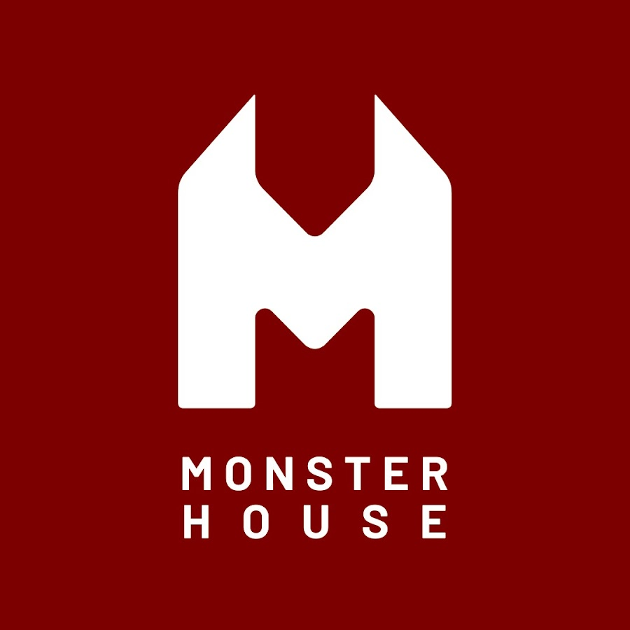
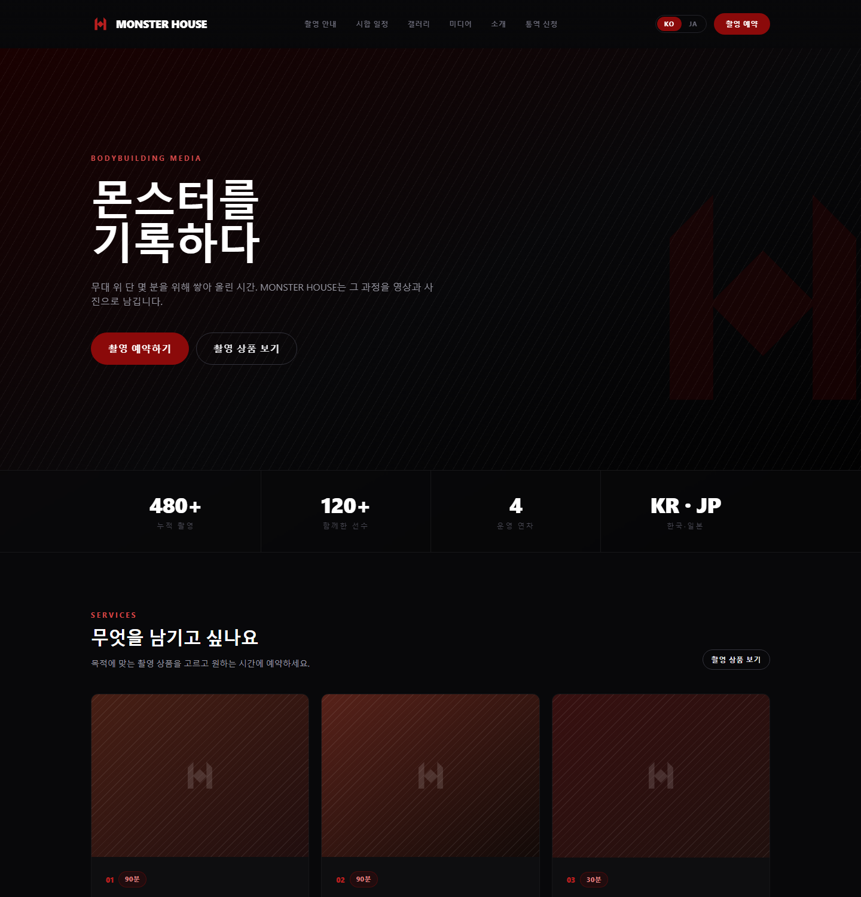
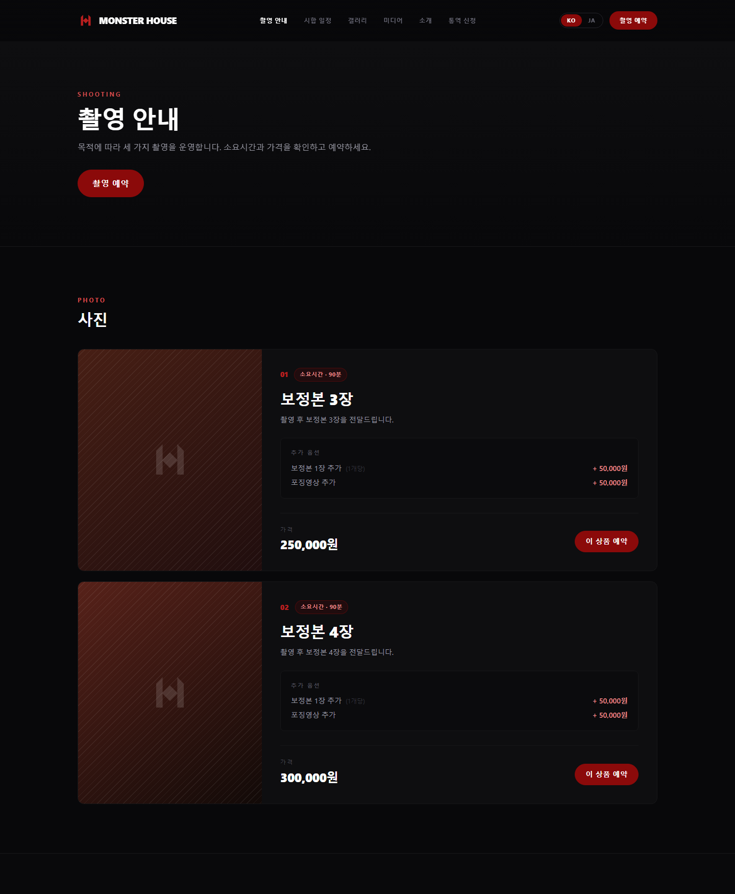
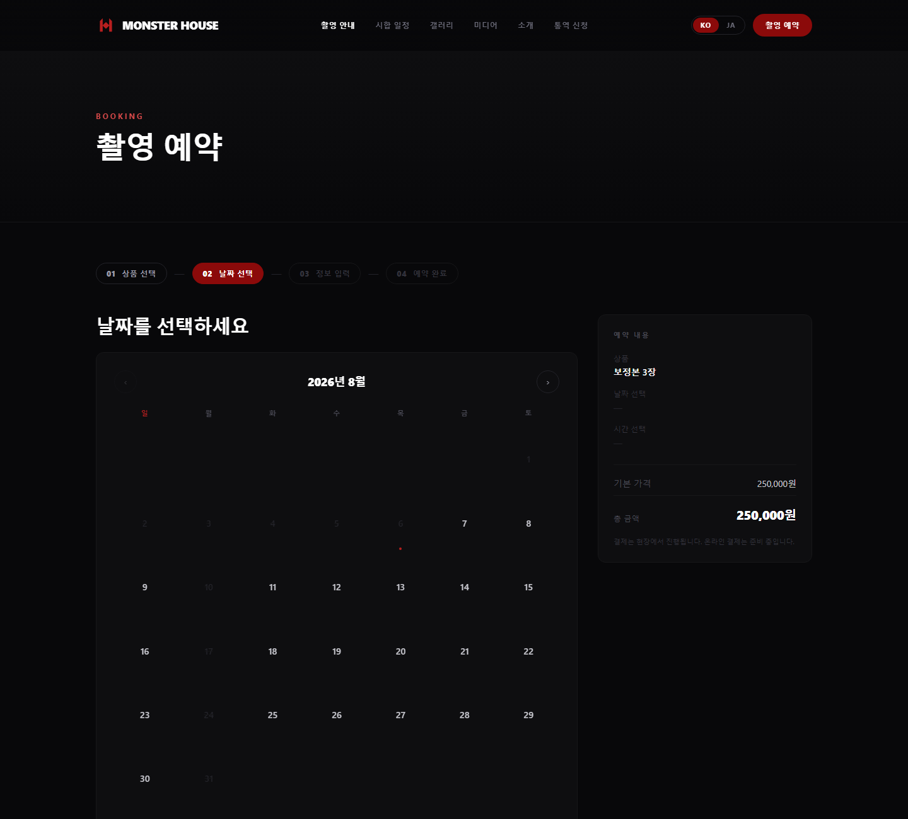
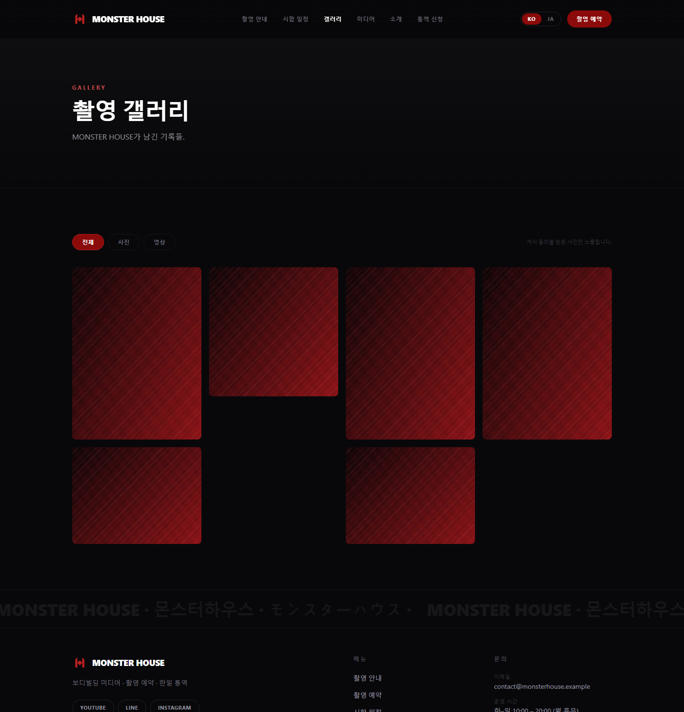
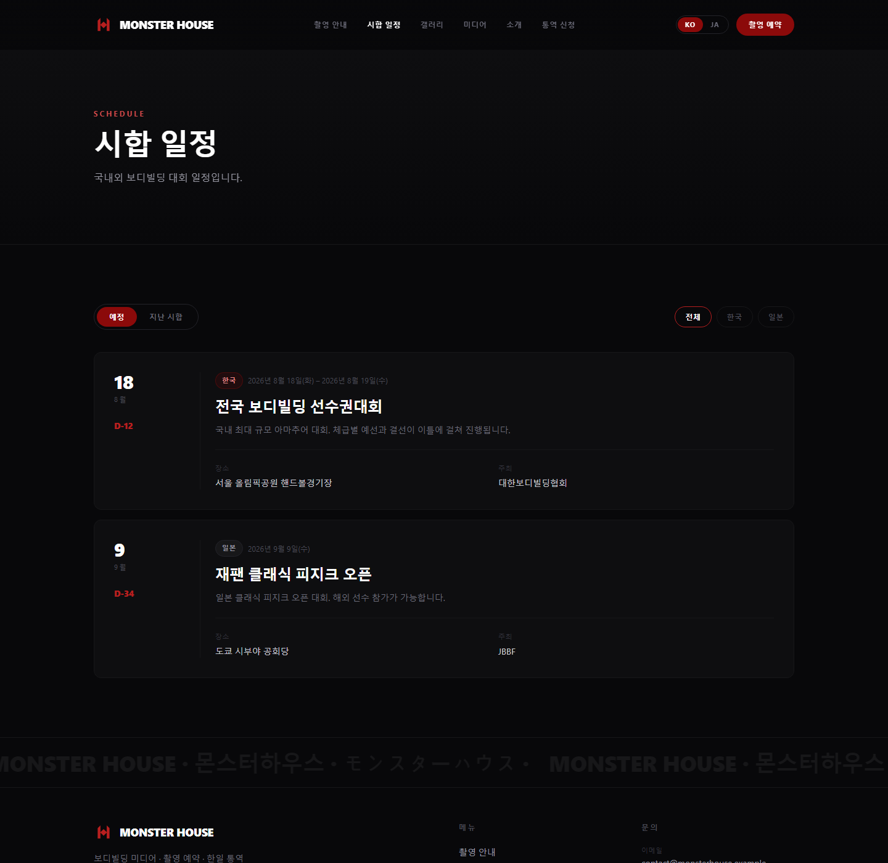
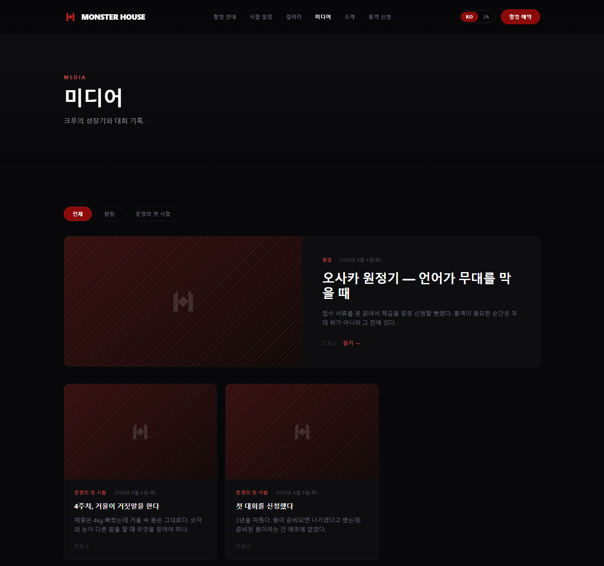
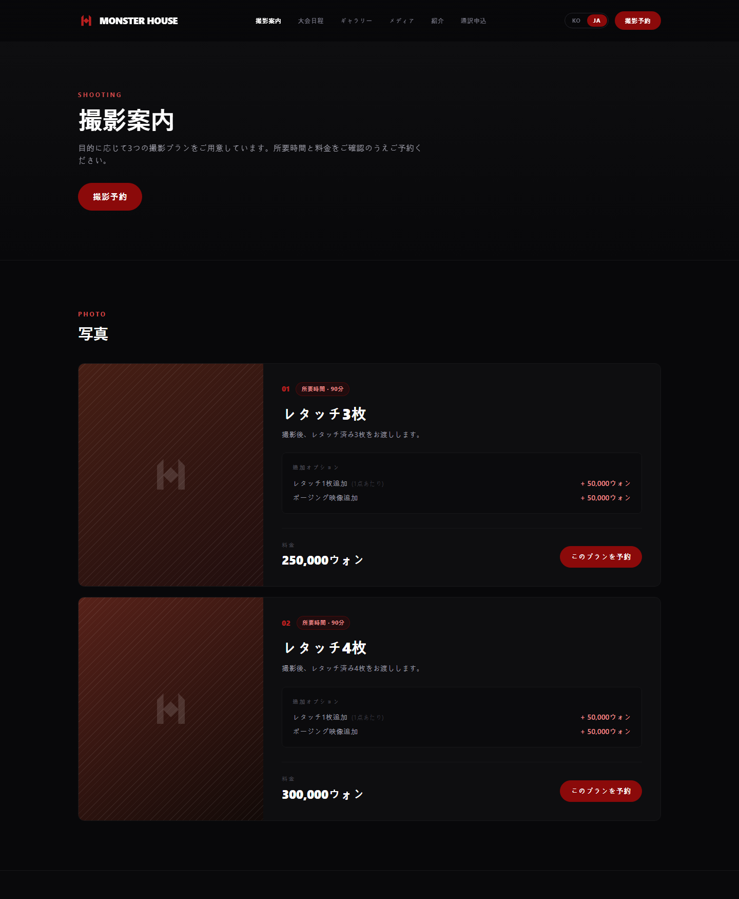

<div align="center">



# MONSTER HOUSE

**보디빌딩 미디어 · 촬영 예약 · 한일 통역**

무대 위 단 몇 분을 위해 쌓아 올린 시간을 영상과 사진으로 남깁니다.

<br />


</div>

<br />

## 무엇을 만들고 있나

보디빌딩 선수와 센터를 위한 **영상·사진 미디어 브랜드의 공식 웹사이트**입니다.
촬영 예약을 온라인으로 받고, 시합 일정과 크루의 성장기를 발신하며,
일본 고객을 위한 통역 신청 창구를 운영합니다.

포트폴리오용 습작이 아니라 **실제로 운영할 목적으로** 만들고 있습니다.

<br />

## 화면

> 실제 동작 화면입니다. 목 데이터가 아니라 **DB에 연결된 상태**에서 캡처했습니다.
> 갤러리 사진은 데모용 플레이스홀더입니다.

<div align="center">
  
  <p><b>메인</b> — 브랜드 소개 · 촬영 상품 · 한일 브릿지</p>
</div>

<table>
  <tr>
    <td width="50%" valign="top"></td>
    <td width="50%" valign="top"></td>
  </tr>
  <tr>
    <td align="center"><b>촬영 안내</b><br/><sub>사진 · 영상 · 통역 가격표와 추가 옵션</sub></td>
    <td align="center"><b>촬영 예약</b><br/><sub>달력 → 시간 → 옵션 → 정보 입력 (4단계)</sub></td>
  </tr>
  <tr>
    <td width="50%" valign="top"></td>
    <td width="50%" valign="top"></td>
  </tr>
  <tr>
    <td align="center"><b>갤러리</b><br/><sub>게시 동의를 받은 사진만 노출</sub></td>
    <td align="center"><b>시합 일정</b><br/><sub>한국·일본 대회, D-day 표시</sub></td>
  </tr>
  <tr>
    <td width="50%" valign="top"></td>
    <td width="50%" valign="top"></td>
  </tr>
  <tr>
    <td align="center"><b>미디어</b><br/><sub>크루 성장기 · 시리즈별 묶기</sub></td>
    <td align="center"><b>日本語 (/ja)</b><br/><sub>UI와 콘텐츠 모두 이중언어</sub></td>
  </tr>
</table>

<br />

## 기술적으로 공들인 지점

이 프로젝트에서 **어려웠던 문제 세 가지**와 그 해법입니다.

<br />

### 1. 예약 동시성 — 같은 시간에 두 사람이 신청하면?

촬영팀은 하나뿐이라 같은 시간대에 두 건을 받을 수 없습니다.
겹침(overlap)은 `UNIQUE` 제약으로 표현할 수 없어서 **3중으로 막았습니다.**

| 층 | 수단 | 막는 것 |
|---|---|---|
| 1 | `booking_day_lock` 행에 `SELECT … FOR UPDATE` | 날짜 단위 직렬화 — 검사~INSERT 임계구역 보호 |
| 2 | overlap 쿼리 `start < :end AND end > :start` | 시간대 겹침 전체 |
| 3 | `UNIQUE(slot_key)` (취소 시 NULL) | 동일 시작시각 — 최후 방어선 |

만드는 과정에서 **설계 결함 두 개를 테스트가 잡아냈습니다.**

- **갭 락 데드락** — 존재하지 않는 행에 `FOR UPDATE`를 걸면 InnoDB가 갭 락을 잡습니다.
  동시 요청들이 서로의 갭 락 때문에 INSERT하지 못해 5건 중 4건이 데드락으로 죽었습니다.
  → 락 행을 **별도 트랜잭션에서 먼저 커밋**한 뒤 잠그도록 순서를 뒤집어 해결
- **REPEATABLE READ 스냅샷** — 락으로 순서를 세워도 일반 SELECT는 트랜잭션 시작 시점의
  스냅샷을 봅니다. 즉 **락을 잡고도 방금 커밋된 예약이 안 보였습니다.**
  → `READ_COMMITTED` 격리수준으로 해결

> 둘 다 테스트가 없었으면 운영에서 중복 예약으로 발견됐을 문제입니다.

<br />

### 2. 진짜 다국어 — UI 번역을 넘어서

한국어와 일본어를 **두 층위로 분리**했습니다.

- **UI 문자열** — `react-i18next` + Spring `MessageSource`. 코드에 문자열 하드코딩 금지
- **콘텐츠** — 번역 테이블 분리 (`post` / `post_translation`)

핵심은 **"같은 글의 번역"과 "언어별 독립 콘텐츠"를 모두 지원**한다는 점입니다.
한국 크루 성장기와 일본 크루 성장기는 서로의 번역이 아니라 별개의 글일 수 있습니다.

번역이 없는 글은 그 언어 목록에서 **제외**하고(폴백 아님), 관리자 화면에는
`일본어 미작성` 배지를 띄웁니다. 반대로 상품·가격은 번역이 없으면 한국어로 **폴백**합니다 —
번역이 없다고 예약을 막으면 매출이 사라지니까요.

```
/ko/media  →  3건
/ja/media  →  2건   ← 번역 없는 글이 빠짐
```

<br />

### 3. 개인정보와 초상권 — 지키기로 한 것은 코드로 강제

- **게시 동의 기본값은 `false`** — 실수로 올린 인물 사진이 곧바로 공개되지 않습니다.
  공개 목록 쿼리에 `consent = true`를 박아 서비스 계층에서 빠뜨릴 수 없게 했습니다
- **보유기간 자동 파기** — 방침에 적은 "촬영 후 1년 / 문의 처리 후 6개월"을
  `application.yml` 한 곳에서 관리하고 배치가 실제로 지웁니다
- **업로드 파일 재인코딩** — 확장자·MIME은 클라이언트가 지어낼 수 있으므로
  실제 디코딩으로 판별하고 전부 JPEG로 재인코딩합니다.
  폴리글롯 파일이 무력화되고 **EXIF의 GPS 좌표도 함께 제거**됩니다

<br />

## 구성

```
monsterhouse/
├── BE/   Java 17 · Spring Boot 3 · JPA + QueryDSL · MySQL 8
└── FE/   React 18 · TypeScript · Vite · Tailwind · TanStack Query
```

| | |
|---|---|
| 백엔드 | 162개 파일 · **57개 API 엔드포인트** |
| 프론트엔드 | 43개 파일 · 한/일 이중언어 라우팅 |
| 테스트 | **29개 통과** (예약 동시성 4 · 관리자 인증 8 · JWT 5 · 문의 5 · 업로드 7) |
| 인프라 | Docker Compose · S3/CloudFront (로컬은 파일시스템으로 대체) |

**주요 도메인**

`booking` 예약·슬롯·동시성 &nbsp;·&nbsp; `content` 미디어·갤러리·시합 일정 &nbsp;·&nbsp;
`inquiry` 통역/영상 문의 + LINE &nbsp;·&nbsp; `admin` JWT 인증 &nbsp;·&nbsp;
`storage` 이미지 파이프라인 &nbsp;·&nbsp; `notification` 메일·LINE 추상화

<br />

## 관리자 인증

리프레시 토큰을 **JWT가 아니라 불투명 랜덤 문자열 + DB 해시 저장**으로 만들었습니다.
JWT는 서명만 맞으면 유효해서 로그아웃이나 탈취 세션 강제 종료를 구현할 수 없기 때문입니다.

- 액세스 토큰은 `Authorization` 헤더, 리프레시는 **httpOnly 쿠키** — XSS로 영구 세션까지 털리지 않게
- **토큰 회전 + 재사용 탐지** — 폐기된 토큰이 다시 들어오면 그 계정의 모든 세션을 끊습니다
- 로그인 시도 제한은 DB 필드로 — 메모리 카운터는 재시작으로 우회됩니다

<br />

<div align="center">
<sub>Seoul · Tokyo &nbsp;|&nbsp; 개발 <b>정재윤</b></sub>
</div>
